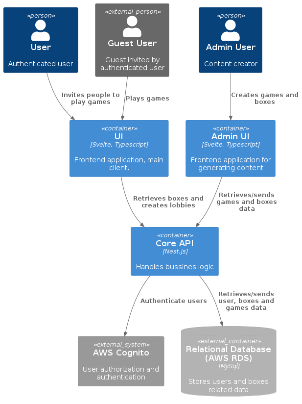
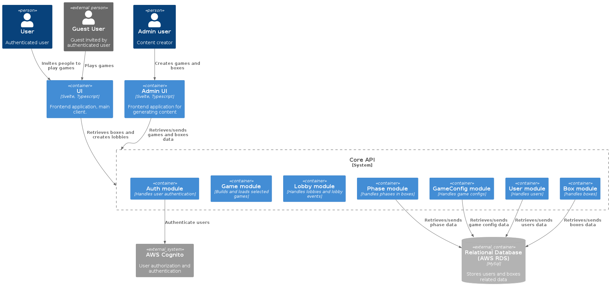
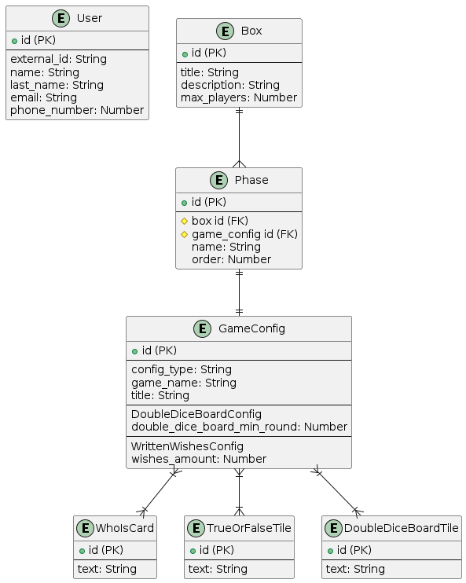

# Together: Server application setup guide

This repository contains the server application for Together. To successfully run the server application, please follow the steps outlined below.

## Prerequisites
Before proceeding with the setup, ensure you have the following prerequisites installed on your system:

- Node.js (Recommended version: Node.js LTS)
- Docker (for running the MySQL database and local Cognito environment)
npm (Node Package Manager, usually comes with Node.js installation)

## C4 Diagrams
### L1

### L2

### Entity relations


# Run the application

## Clean Install Dependencies

- Open a terminal.
- Navigate to the root of the repository.
- Run the following command to perform a clean installation of project dependencies:

```bash
  npm ci
```

## Configure Environment Variables
Rename the provided .env.dist file to .env.
Open the .env file and make sure to replace the placeholders with appropriate values for your environment. Set the following variables:
```bash
NODE_ENV=development
PORT=       # Port number for the server
LOGGER_LEVELS=verbose
BASE_TEST_ADDRESS=http://localhost
DB_PATH=./data/database.db
DB_HOST=     # Database host (if applicable)
DB_PORT=     # Database port (if applicable)
DB_USERNAME= # Database username (if applicable)
DB_PASSWORD= # Database password (if applicable)
DB_NAME=     # Database name (if applicable)
COGNITO_ENDPOINT=
COGNITO_APP_CLIENT_ID=
COGNITO_USER_POOL_ID=
```
This project also uses specific .env files for the different states of the application. e.g.: .env.development, .env.automated_tests. (take a look to the ormconfig.ts file)

## Run Docker Containers
Open a new terminal.
Navigate to the root of the repository.
Run the following command to start the Docker containers:

```bash
docker-compose up
```
This command will initialize the necessary services, including the database.

## Run Server Application
In a separate terminal, ensure you are in the root directory of the repository.
Run the following command to start the server in development mode:

```bash
npm run start:dev
```
This command will start the server application and enable automatic reloading during development.

## Run Migrations
If this is the first time you are running the server application or whenever you modify the table schemas, you need to run migrations.

- Make sure the Docker containers are running (Step 3).
- In the root directory of the repository, run the following command:

```bash
npm run migration:run
```

This command will apply the database migrations or synchronize the schemas, ensuring your database is up to date.

Please note that you should perform this step every time you change your table schemas.

Make sure to add migrations files every time schemas are modified. 
To generate a migration file with code that updates table schemas, run the following command.

```bash
npm run migration:generate  --name=name-of-the-migration
```
# API Reference
## Auth
### Signup user

```http
  Post /auth/signup
```
Body:
|Field         | Type     | Description|
:------------ | :------- | :---------------------------
`email`       | `string` | **Required**. User's email.
`phoneNumber` | `string` | **Required**. Phone number.
`name`        | `string` | **Required**. User's name.
`lastName`    | `string` | **Required**. User's last name.
`password`    | `string` | **Required**. User's password.


Response:
```bash
 HTTP status code: 201
```

### Login user

```http
  Post /auth/login
```
Body:
Field       | Type     | Description
:---------- | :------- | :------------------------
`email`     | `string` | **Required**. User's email.
`password`  | `string` | **Required**. User's password.

Response: CognitoUserSession

```bash
 HTTP status code: 201

{
    "idToken": {
        "jwtToken": "jwtToken",
        "payload": {...}
    },
    "refreshToken": {
        "token": "jwtToken"
    },
    "accessToken": {
        "jwtToken": "jwtToken",
        "payload": {...}
    },
    "clockDrift": 0
}
```
## User
### Get all users
```http
  Get /user
```
Response:
```bash
 HTTP status code: 200

 {
        users: [
          {
            "id": 1,
            "externalId": 'external_id',
            "email": 'test@email.com',
            "name": 'test',
            "lastName": 'test',
            "phoneNumber": 12345678,
            "createdAt": '2023-08-31T04:24:32.000Z',
            "updatedAt": '2023-08-31T04:24:32.000Z',
            "deletedAt": null
          },
        ],
        "count": 1
      }
```
### Get user
```http
  Get /user/:id
```
Response:
```bash
 HTTP status code: 200


    {
        id: 1,
        externalId: 'external_id',
        email: 'test@email.com',
        name: 'test',
        lastName: 'test',
        phoneNumber: 12345678,
        createdAt: '2023-08-31T04:24:32.000Z',
        updatedAt: '2023-08-31T04:24:32.000Z',
        deletedAt: null
    }
      

     
```

## Box

### Create a box
```http
  Post /box
```
Body:
Field       | Type     | Description
:---------- | :------- | :------------------------
`title`     | `string` | **Required**. Box title.
`description`  | `string` | **Required**. Box description.
`maxPlayers`  | `number` | **Required**. Max players limit for the games inside this box. 


```bash
 HTTP status code: 201

{
	"id": 1,
	"title": "box title",
	"description": "box description",
	"maxPlayers": 4,
	"deletedAt": null,
	"createdAt": "2023-08-25T18:31:53.075Z",
	"updatedAt": "2023-08-25T18:31:53.075Z"
}
```

### Get all boxes
```http
  Get /box
```

Response:
```bash
 HTTP status code: 200

{
	"boxes": [
		{
			"id": 1,
			"title": "Box title",
			"description": "Box description",
			"maxPlayers": 4,
			"createdAt": "2023-08-30T17:24:07.597Z",
			"updatedAt": "2023-08-30T17:24:07.597Z",
			"deletedAt": null,
			"phases": [
				{
					"id": 1,
                    			"order": 1,
					"name": "Warm up",
					"createdAt": "2023-08-30T17:24:36.958Z",
					"updatedAt": "2023-08-30T17:24:36.958Z",
					"deletedAt": null
				}
			]
		}
	],
	"count": 1
}
```

### Get box
```http
  Get /box/:id
```

Response:
```bash
 HTTP status code: 200

{
	"id": 1,
	"title": "Box title",
	"description": "Box description",
	"maxPlayers": 4,
	"createdAt": "2023-08-30T17:24:07.597Z",
	"updatedAt": "2023-08-30T17:24:07.597Z",
	"deletedAt": null,
	"phases": [
		{
			"id": 1,
            		"order": 1,
			"name": "Warm up",
			"createdAt": "2023-08-30T17:24:36.958Z",
			"updatedAt": "2023-08-30T17:24:36.958Z",
			"deletedAt": null,
			"gameConfig": {...}
		}
	]
}
```
### Update a box
```http
  Put /box/:id
```
Body:
Field       | Type     | Description
:---------- | :------- | :------------------------
`id`     | `number` | **Required**. Box id.
`title`     | `string` | **Optional**. Box title.
`description`  | `string` | **Optional**. Box description.
`maxPlayers`  | `number` | **Optional**. Max players limit for the games inside this box. 

Response:
```bash
 HTTP status code: 200

{
	"id": 1,
	"title": "updated box title",
	"description": "updated box description",
	"maxPlayers": 4,
	"deletedAt": null,
	"createdAt": "2023-08-25T18:31:53.075Z",
	"updatedAt": "2023-08-25T18:31:53.075Z"
}
```

### Delete a box
```http
  Delete /box/:id
```
Response:
```bash
 HTTP status code: 200

{
	"title": "deleted box title",
	"description": "deleted box description",
	"maxPlayers": 4,
	"deletedAt": null,
	"createdAt": "2023-08-25T18:31:53.075Z",
	"updatedAt": "2023-08-25T18:31:53.075Z"
}
```

### Add a game to a box


```http
  Post /box/:id/game-config
```
Body:
Field       | Type     | Description
:---------- | :------- | :------------------------
`configId`     | `number` | **Required**. Game config id.
`phaseName`  | `string` | **Required**. Name of the phase the game belongs.
`phaseOrder`  | `number` | **Required**. Order of the phase to determine which game should be played first. 


```bash
 HTTP status code: 201

{
	"id": 1,
	"title": "Box title",
	"description": "Box description",
	"maxPlayers": 4,
	"createdAt": "2023-08-30T18:31:16.532Z",
	"updatedAt": "2023-08-30T18:31:16.532Z",
	"deletedAt": null,
	"phases": [
		{
			"name": "phase name",
			"order": 1,
			"gameConfig": {...},
			"deletedAt": null,
			"id": 1,
			"createdAt": "2023-08-30T18:31:32.276Z",
			"updatedAt": "2023-08-30T18:31:32.276Z"
		}
	]
}
```

### Delete a game from a box
```http
  Delete /box/:boxId/game-config
```
Body:
Field       | Type     | Description
:---------- | :------- | :------------------------
`configId`     | `number` | **Required**. Game config id.

Response:

```bash
 HTTP status code: 200

{
	"id": 1,
	"title": "Box title",
	"description": "Box description",
	"maxPlayers": 4,
	"createdAt": "2023-08-30T18:31:16.532Z",
	"updatedAt": "2023-08-30T18:31:16.532Z",
	"deletedAt": null,
	"phases": []
}
```
# Phase
Phases are created automatically when adding a game to a box. Phases can be updated and deleted. When deleting a phase, the game config in that phase is not deleted and can be used in another box or phase.
### Update a phase
```http
  Put /phase/:id
```
Body:
Field       | Type     | Description
:---------- | :------- | :------------------------
`id`     | `number` | **Required**. Phase id.
`phaseName`     | `string` | **Optional**. Phase name.
`phaseOrder`  | `number` | **Optional**. Phase order. This number determines which game is played first.

Response:
```bash
 HTTP status code: 200

{
	"id": 1,
	"order": 1,
	"name": "Warm up",
	"createdAt": "2023-08-30T18:31:32.276Z",
	"updatedAt": "2023-08-30T18:31:32.276Z",
	"deletedAt": null,
}
```
### Delete a phase 
```http
  Delete /phase/:id
```
Response:
```bash
 HTTP status code: 200

{
	"title": "deleted box title",
	"description": "deleted box description",
	"maxPlayers": 4,
	"deletedAt": null,
	"createdAt": "2023-08-25T18:31:53.075Z",
	"updatedAt": "2023-08-25T18:31:53.075Z"
}
```
# Add game configs

```http
  Post /game-config
```


Game config types are discriminated by the "configType" property. Also, the config must be sent inside a property named "config" to get validated properly.
Body:

Field       | Type     | Description
:---------- | :------- | :-----------------------
`config`     | `GameConfigDto` | **Required**. any game config dto.

```bash
        {
	config: {
		"id": 1,
		"configType": "WrittenWishesConfig",
		"gameName": "Written wishes",
		"title": "Written wishes test",
		"wishesAmount": 3
		}
        }
```


# Update game configs

```http
  Put /game-config/:id
```

To update a game config the updated config must be sent inside the config property.
Body:

Field       | Type     | Description
:---------- | :------- | :-----------------------
`config`     | `GameConfigDto` | **Required**. any game config dto .


```bash
        {
        	config: {
			"id": 1,
			"configType": "WrittenWishesConfig",
			"gameName": "Written wishes",
			"title": "updated Written wishes",
			"wishesAmount": 3
			}
        }
```

# Delete configs

```http
  Delete /game-config/:id
```


Response:
```bash
Http status code 200
{
    "id": 1
	"configType": "WrittenWishesConfig",
	"gameName": "Written wishes",
	"title": "Written wishes test",
	"wishesAmount": 3
}
        
```
# Games
These are the body schemas of the existing games.
## Who is

Body:
Field       | Type     | Description
:---------- | :------- | :------------------------
`configType`     | `string` | **Required**. Game config type.
`gameName`     | `string` | **Required**. Game name.
`title`     | `string` | **Required**. Game title.
`whoIsCards`     | `WhoIsCardDto[]` | **Required**. Game cards.

```bash
WhoIsCardDto {
        text: "card text" // required
       }
```
Response:
```bash
 HTTP status code: 201

{
    "id": 1,
    "configType": "WhoIsConfig",
    "gameName": "Who is",
    "title": "Who is test",
    "whoIsCards": [...] 
}

 ```


## True or false

Body:
Field       | Type     | Description
:---------- | :------- | :------------------------
`configType`     | `string` | **Required**. Game config type.
`gameName`     | `string` | **Required**. Game name.
`title`     | `string` | **Required**. Game title.
`trueOrFalseTiles`     | `TrueOrFalseTileDto[]` | **Required**. Board tiles.

```bash
TrueOrFalseTileDto {
        text: "tile text" // required
       }
```
Response:
```bash
 HTTP status code: 201

{
    "id": 1,
    "configType": "TrueOrFalseConfig",
    "gameName": "True or false",
    "title": "True or false test",
    "trueOrFalseTiles": [...] 
}

 ```

 
## Double dice board

Body:
Field       | Type     | Description
:---------- | :------- | :------------------------
`configType`     | `string` | **Required**. Game config type.
`gameName`     | `string` | **Required**. Game name.
`title`     | `string` | **Required**. Game title.
`doubleDiceBoardTiles`     | `DoubleDiceBoardTileDto[]` | **Required**. Board tiles. This tiles array must have 36 elements.

```bash
DoubleDiceBoardDto {
        text: "tile text" // required
       }
```
Response:
```bash
 HTTP status code: 201

{
    "id": 1,
    "configType": "DoubleDiceBoardConfig",
    "gameName": "Double dice board",
    "title": "Double dice board test",
    "doubleDiceBoardTiles": [...] 
}

 ```

 ## Written wishes

Body:
Field       | Type     | Description
:---------- | :------- | :------------------------
`configType`     | `string` | **Required**. Game config type.
`gameName`     | `string` | **Required**. Game name.
`title`     | `string` | **Required**. Game title.
`wishesAmount`     | `number` | **Required**. Amount of wishes per player.


Response:
```bash
 HTTP status code: 201

{
    "id": 1,
    "configType": "WrittenWishesConfig",
    "gameName": "Written wishes",
    "title": "Written wishes test",
    "wishesAmount": 3 
}

 ```

